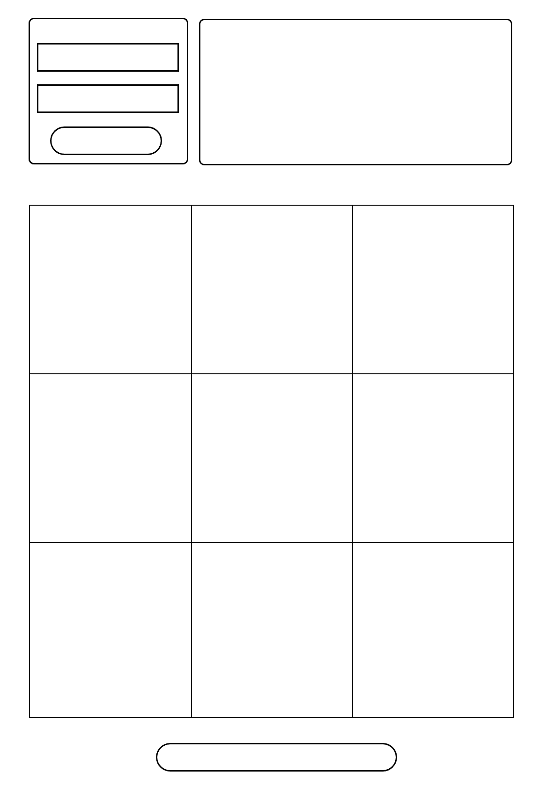

# The complete app can be found here
[Tic Tac Toe Isabella] (https://mindmarine.github.io/tictacttoe-isabella/)

# Objective

Create a game for Isabella to improve her Tic Tac Toe skills so she could spend more time playing this game with her daughter at a competitive level

# App Plan and Research

## Users Stories

•	As Isabella I would like to be able to practice Tic Tac Toe by myself
•	In order to spend more time with my daughter as a mother I would like to improve my Tic Tac Toe skills
•	In order to increase my Tic Tac Toe skills as mother I would like to be able to practice the game by myself
•	As Isabella I would like to be able to practice Tic Tac Toe alone
•	As Isabella I would like to be able to sign up for the game
•	In order to start the game as Isabella (mother) I would like to be able to sign up
•	In order to hide my practice of the game from my daughter as Isabella I would like to be able to sing out from the game
•	In order to practice I would like to be able to play Tic Tac Toe as both player
•	In order to understand what is on my daughter mind I would like to play by myself (to take turns playing Tic Tac Toe
•	In order to increase my Tic Tac Toe playing skills I would like to be able to start the game
•	In order to understand how I am progressing as Isabella I would like to understand which of the two me (which one) of the players I play with wins

## Wireframe

# Technologies used
HTML
CSS
javascript
bootstrap
flexbox
API AJAX
API Heroku
